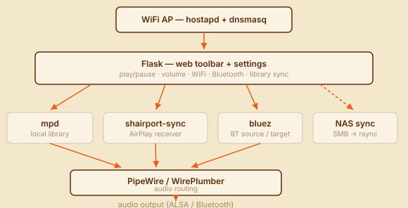

<p align="center">
  
</p>

<p align="center">
  
  &nbsp;&nbsp;
  
  &nbsp;&nbsp;
  
</p>

---

## The story

For a long time I had a pi zero w on my desk.  It had a beautiful case on it and I loved it, but it had been reduced to fidget toy - there just wasn't anything it was enough for, and I hated that.  The zero w came from a time when SBCs were brand new, super cheap, and super fun.  I missed an ecosystem that came from a different time.

Kinda like music.

I used to spend a lot of time on and get a lot of joy from music.  Something about streaming (as rad as it is) just doesn't resonate with me.  Having all the music on a buffet table gives me paralysis, and when I do manage to pick something I feel no connection.  I miss having a collection, and I miss the feeling of connection to each and every album in that collection.  Even if all you did was buy it in an airport because you got stuck waiting an extra three hours, that's a connection.  Most of your collection is probably even more important - things you or your friends recorded yourselves.  Things you bought on trips to places you've never been back to.  Flea market finds you couldn't believe you got for two dollars.  You know, stories.

So I made this.  Turns out, they're perfect for each other - a zero w has _just_ about enough juice to be a great place to hold a copy of your collection and to play it the ways you'd want.  It can hang out on your network and operate some speakers for you.  It can serve a webapp to show you what you've got.  It can keep up to date as you add stuff.  And since it's comfortably under even the 500mA of an OG USB 1.1 port, it can get its power nearly anywhere and you can slip it in a pocket.  It doesn't have any buttons, but it can project an access point and we all have phones now.  And of course speaking of phones, it can still take a Bluetooth stream from your phone if that's how you roll, or stream to a Bluetooth speaker if that's what you have.  Best of all, it's so old and so weak that you can still find one in stock very occasionally, which as of this writing is true of basically nothing else in the Pi lineup.

As I was building this, though, I also realized it's decaying fast.  The ancient arch of this machine is dying, and the images I'm producing may well be limited editions, so if anyone else wants a zero-fi I should make these images available.

## Getting started

**Download and Flash:** Grab the latest `.img.xz` from [Releases](../../releases/latest), decompress it, and flash to a microSD. Skip to the boot step below.

**Or, Build it Yourself:**

Nothing here is bespoke besides the control frame!  I encourage remixes - use whatever, however.

> Both scripts need `sudo` — `build-image.sh` creates and mounts loop devices to build the ARM chroot on an x86 host; `flash-sd.sh` writes directly to a block device. Read them before running, don't pipe to sudo bash, folks!

Build dependencies: `parted`, `dosfstools`, `e2fsprogs`, `exfatprogs`, `rsync`, `tar`, `qemu-user-static`, and binfmt_misc registered for ARM (`qemu-user-static-binfmt` on Arch/Manjaro; `binfmt-support` on Debian/Ubuntu). Also `python3` (stdlib only) and `curl`.  OSX users, yeah you probably have to build in a VM, sorry - the processor arch translation is hard enough you don't wanna also be trying to figure out loop devs on `hdiutil`.

```
sudo bash build/build-image.sh
sudo bash build/flash-sd.sh /dev/sd<letter here which is probably b but this is a danger zone so please be sure>
```

As a special thanks for building yourself, you get a pre-expanded music partition so first boot is way faster! You can also bake in SSH keys, a custom config, and even pre-load music before the card ever boots.

**SSH access:** place an `authorized_keys` file at `pi/root/root/.ssh/authorized_keys` before building. The builder copies it in and enables SSH (Dropbear) automatically. Without it, SSH is disabled.

**Pre-seeded config:** copy `flask_app/app.py`'s `_default_config()` structure to `build/zerofi.json` (this path is gitignored), edit to taste — WiFi credentials, instance name, whatever — and the builder will bake it into the image. The device boots with your settings already applied instead of defaults.

**Pre-loaded music:** the music partition is a plain exFAT volume. After flashing, mount it on your host and copy files in before first boot. mpd will see them once it scans.

**Boot:** Insert the card and power on. **First boot takes 5–10 minutes** (longer on larger or slower SD cards) — the music partition expands to fill the card, the system configures itself, and the device reboots once. After that you'll see a `🎵 Zero-Fi-XXXX` WiFi network appear (XXXX = last 4 hex digits of the MAC address).

Connect to it (no password by default) and open `http://zero-fi.local` or the AP's gateway address. The web toolbar is there. That's it.  It'll also give you a "Sign in" pop-up on most phones, which will get you straight to the interface.

The install takes about 2G or so, it could be slimmer but given the modal size of collections / SD cards I'm going to bet you don't mind.  If you do, it's all open source after all, modify as you please.

## Architecture

<p align="center"></p>

**Web app** — Flask serves the toolbar and settings page. Controls mpd via MPC, PipeWire volume via `wpctl`, and bluetooth/wifi via D-Bus and shell calls. Config lives at `zerofi.json` on the music partition — back it up to preserve settings; deleting it resets to defaults.  A lot of control has been wadded into this app, largely without regard for security or best practice.  It's an appliance.

**Playback** — mpd handles the local library; myMPD provides a full-featured web player alongside the toolbar. shairport-sync receives AirPlay and routes it through PipeWire. Bluetooth operates in two modes: _target_ (Zero-Fi receives from a phone) and _source_ (Zero-Fi sends to a Bluetooth speaker or headphones), managed by a bluez agent script.

**Network** — hostapd runs a 2.4 GHz AP by default (configurable). wpa_supplicant can join a second network simultaneously (AP+STA). nftables gates LAN access so the open AP only reaches the device itself by default — no bridging to the home network unless you configure it. My advice would be to only use AP or wi-fi client one at a time, but hey maybe you're having a party and everyone should also be able to queue tracks.  If you want the AP for a road trip, just grab and go - a non-working wi-fi client falls back to projecting an access point.

**Resilience** — a heartbeat script monitors mpd and key services, reboots on hung states, and caps total reboots to avoid boot loops.

**Theming** - a truly shocking portion of the shipped code is "hacky monkey patches to try to force full theming on an unwilling mympd" and I regret nothing.

<details>
<summary><strong>Components &amp; licenses</strong></summary>
<br>

Zero-Fi's own code is [MIT licensed](LICENSE). The distributed image bundles third-party components as separate, independently-running processes — none linked into Zero-Fi, but I'll still do a best effort at letting you know what you're using:

| Component | License | Source |
|---|---|---|
| [DietPi](https://dietpi.com/) RPi1-ARMv6 (base image) | GPL-2.0 + others | dietpi.com |
| Linux kernel | GPL-2.0 | DietPi |
| [mpd](https://www.musicpd.org/) | GPL-2.0 | Debian |
| [myMPD](https://jcorporation.github.io/myMPD/) | GPL-3.0 | [jcorporation OBS](https://download.opensuse.org/repositories/home:/jcorporation/) |
| [PipeWire](https://pipewire.org/) + [WirePlumber](https://pipewire.pages.freedesktop.org/wireplumber/) | MIT | Debian |
| [shairport-sync](https://github.com/mikebrady/shairport-sync) | MIT | Debian |
| [bluez](http://www.bluez.org/) | GPL-2.0 | Debian |
| [Flask](https://flask.palletsprojects.com/) (python3-flask) | BSD-3-Clause | Debian |
| hostapd / wpa_supplicant | BSD / GPL-2.0 | Debian |
| nftables | GPL-2.0 | Debian |
| Dropbear | MIT | DietPi |
| BCM43430A1.hcd (BT firmware) | Broadcom proprietary — redistributable for hardware use | [RPi-Distro/bluez-firmware](https://github.com/RPi-Distro/bluez-firmware) |
| [Lobster](https://fonts.google.com/specimen/Lobster) (brand/heading font) | SIL OFL 1.1 | Google Fonts, self-hosted in `static/fonts/` |
| [DM Sans](https://fonts.google.com/specimen/DM+Sans) (UI font) | SIL OFL 1.1 | Google Fonts, self-hosted in `static/fonts/` |

Debian and Raspbian upstream provide source for all GPL components.

</details>
